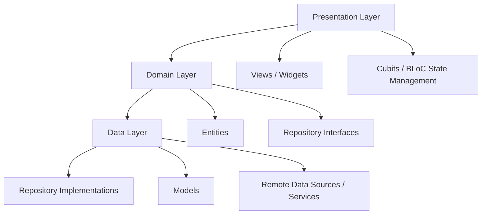
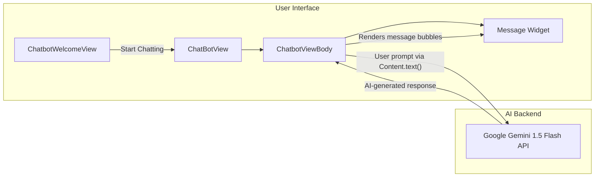

# 🏥 Tamenny — AI-Powered Healthcare Diagnostic System

## Full Graduation Project Description

---

## 📌 Project Overview

**Tamenny** (Arabic: "طمّني", meaning "Reassure Me") is an AI-powered mobile healthcare application developed using **Flutter** as a graduation project. The application serves as a comprehensive digital health platform that bridges the gap between patients and healthcare services by leveraging artificial intelligence, real-time data, and community-driven health engagement.

The system integrates **AI-based medical image diagnosis**, an **intelligent conversational chatbot**, a **geolocation-based doctor finder**, a **medical news aggregation engine**, and a **social health community** — all within a single, multilingual (English/Arabic) cross-platform mobile application.

> [!IMPORTANT]
> **Repository:** [https://github.com/Abdelrahmanyusuf/AI-Powered-Healthcare-Diagnostic-System](https://github.com/Abdelrahmanyusuf/AI-Powered-Healthcare-Diagnostic-System)

---

## 🏗️ System Architecture

The project follows **Clean Architecture** principles with strict separation of concerns across three layers:



| Layer | Responsibility | Key Contents |
|-------|---------------|--------------|
| **Presentation** | UI rendering, user interaction, state management | Flutter Widgets, BLoC Cubits, Views |
| **Domain** | Business logic contracts, pure entities | Abstract Repository interfaces, Entity classes |
| **Data** | Concrete implementations, API calls, data mapping | Repository implementations, Data Models, Services |

### Dependency Injection
The project uses **GetIt** as a service locator for dependency injection, registering all services, repositories, and cubits at app startup for clean, testable, and decoupled code.

---

## ✨ Core Features (Modules)

### 1. 🔐 Authentication Module (`features/auth/`)
- **Email/Password** sign-up and sign-in with Firebase Authentication
- **Google Sign-In** (OAuth 2.0) integration
- **Facebook Login** integration
- **Forgot Password** flow with email-based reset
- User data persistence in **Cloud Firestore** and local caching via **Hive**
- Automatic authentication state monitoring on app launch
- Custom error handling with user-friendly messages for all auth failure scenarios

### 2. 🏠 Home Dashboard (`features/home/`)
- **Main Banner** with health promotional content
- **Health Tips Section** — curated health tips displayed in a horizontal scrollable list
- **Medical News Aggregation** — real-time medical articles fetched from an external API via **Dio HTTP client**, with a dedicated full-article view
- **Health Scan Categories** — categorized scan options (e.g., Lung Disease, Skin Analysis) displayed as interactive cards for initiating AI scans
- **Nearby Doctors Preview** — quick-access list of nearest doctors pulled from Firestore
- **Latest Scan Results** — recent AI diagnosis results with status indicators
- **Search Functionality** — animated search text field with real-time filtering
- **Push Notifications** — Firebase Cloud Messaging (FCM) integration with local notification handling
- **Shimmer Loading** — skeleton loading animations for improved perceived performance

### 3. 🔬 AI Health Scanning (`features/scan/`)
- **Step-by-step scanning workflow**: Select category → Upload image → Process → View results
- **Image Upload** from device camera or gallery via `image_picker`
- **AI Diagnosis Engine** — sends medical images to an AI backend model for analysis (Lung disease classification: Malignant / Benign)
- **Diagnosis Result Persistence** — results stored in Firestore per user, with scan images uploaded to **Supabase Storage**
- **Result Screen** — displays diagnosis status (Normal / Moderate / Critical), summary, scanned image, and timestamp
- **Scan History** — all past diagnosis results retrievable from the user's Firestore profile

### 4. 💬 AI Medical Chatbot Assistant (`features/chatbot/`) — *Your Primary Role*
> Detailed in the dedicated section below.

### 5. 🗺️ Nearby Doctors Map (`features/map/`)
- **Interactive Map** powered by `flutter_map` with OpenStreetMap tiles
- **Custom Markers** for each doctor's geolocation (latitude/longitude)
- **Doctor Details View** — full profile with name, specialty, city, rating, address, phone, and profile image
- **Click-to-Call** functionality via `url_launcher`
- **Doctor Data** fetched in real-time from Cloud Firestore
- **List View** — alternative scrollable list of all nearby doctors

### 6. 👥 Community Forum (`features/community/`)
- **Real-time Post Feed** — live-updating stream of community posts using Firestore Snapshots
- **Create Posts** — users can compose text posts with optional image attachments (uploaded to Supabase)
- **Commenting System** — nested comments on each post with author info and timestamps
- **Like System** — users can like/unlike posts with real-time count updates
- **Privacy Controls** — post visibility options
- **Time Ago Display** — human-readable relative timestamps ("2 hours ago")
- **User Attribution** — each post shows author avatar, name, and creation time

### 7. 👤 User Profile (`features/profiel/`)
- **Personal Information View** — display and edit name, email, avatar
- **Avatar Upload** — profile picture upload via Supabase Storage with Firestore URL update
- **Change Password** — secure password change with current password verification via Firebase reauthentication
- **Privacy Center** — privacy settings and data controls
- **FAQ Section** — expandable FAQ items with tap-to-expand functionality
- **Theme Toggle** — light/dark mode switch with persistence via SharedPreferences
- **Language Switch** — English/Arabic toggle with persistence
- **Sign Out** — secure session termination

### 8. 🎬 Onboarding & Splash (`features/onboarding/`, `features/splash/`)
- **Animated Splash Screen** — Lottie animations with logo and app name
- **Multi-step Onboarding** — page-view based onboarding with smooth page indicators and illustrations
- **Welcome Screen** — sign-in/sign-up gateway with branded header

---

## 💬 Your Role: AI Medical Chatbot Assistant — Detailed Breakdown

> [!NOTE]
> This section details Abdelrahman's primary contribution to the project — the **AI-Powered Medical Chatbot Assistant** feature.

### Overview
The Chatbot Assistant ("Tamenny Bot") is an intelligent, conversational medical assistant that enables users to interact with an AI model in natural language to ask health-related questions, get symptom analysis, receive medical recommendations, and learn about health topics — all within the app.

### Technical Implementation Details

#### 1. AI Model Integration
- **Model Used:** Google Gemini 1.5 Flash (`gemini-1.5-flash-latest`)
- **SDK:** `google_generative_ai` (v0.4.6) — Google's official Dart/Flutter SDK for Generative AI
- **Communication:** Direct API calls to Google's Generative AI service — the chatbot sends user prompts as `Content.text()` objects and receives AI-generated responses in real-time
- **Architecture:** Client-side integration — the model is initialized as a `GenerativeModel` instance in the chatbot's stateful widget, ensuring a persistent session per conversation

#### 2. Chatbot Welcome Screen (`ChatbotWelcomeView`)
You designed and implemented a dedicated **welcome/onboarding screen** for the chatbot that includes:
- **Feature highlights** with checkmark icons explaining what the chatbot can do:
  - Ask health-related questions
  - Get personalized recommendations
  - Learn about health topics
- **Step-by-step usage guide** (How to use the chatbot)
- **"Start Chatting" CTA button** that navigates to the main chat interface
- Full **dark/light theme support** with system UI overlay adaptation
- All text content is **fully localized** (English & Arabic) using the app's `intl` localization system

#### 3. Chat Interface (`ChatbotViewBody`)
You built the core conversational interface consisting of:
- **Message List:** A `ListView.builder` rendering the conversation history in real-time, with messages stored in a local list of `{text, sender}` maps
- **Message Input Area:** A styled `TextField` with:
  - Theme-adaptive colors (card background, hint text)
  - Rounded container with no visible borders for a modern, clean look
  - Attachment button (for future image/file sharing capabilities)
  - Send button with custom SVG icon
- **Send Logic (`addMessage()`):**
  - Validates that the prompt is non-empty
  - Immediately adds the user's message to the conversation (optimistic UI)
  - Clears the text field
  - Sends the prompt to the Gemini API via `model.generateContent()`
  - Appends the AI response to the message list
  - Triggers `setState()` for both user and bot messages to update the UI in real-time

#### 4. Message Bubble Widget (`Message`)
You created a reusable, theme-aware message bubble widget with:
- **Sender alignment:** User messages align right, bot messages align left
- **Visual distinction:** User messages use the app's `primaryColor` with white text; bot messages use the theme's `cardColor` with adaptive text color
- **Constraints:** Max width of 300px to maintain readability
- **Rounded corners** (12px border radius) for a modern chat appearance
- **Consistent typography** using the app's design system (`AppStyles.font14Regular`)

#### 5. Theming & Localization
- The entire chatbot feature adapts to **both light and dark themes** seamlessly
- All user-facing strings are localized via `.arb` files supporting **English and Arabic**, including:
  - Welcome screen titles and descriptions
  - Feature bullet points
  - Step-by-step instructions
  - Input placeholder ("Send a message...")
  - Button text ("Start Chatting")

#### 6. Navigation & Routing
- Registered the chatbot route (`Routes.chatBotView`) in the app's centralized routing system
- Integrated the chatbot welcome screen into the app's **bottom navigation bar** for easy access
- Implemented proper navigator routing with `rootNavigator: true` for full-screen chat experience

### Files You Created/Owned

| File | Purpose |
|------|---------|
| [chat_bot_view.dart](file:///f:/AI%20LEVEL%204/AI%20SEMESTER%20(2)/Graduation%20Project%202_PC40210699_89_242/tamenny_app-main/lib/features/chatbot/presentation/views/chat_bot_view.dart) | Main chatbot screen with app bar and scaffold |
| [chat_bot_welcome_view.dart](file:///f:/AI%20LEVEL%204/AI%20SEMESTER%20(2)/Graduation%20Project%202_PC40210699_89_242/tamenny_app-main/lib/features/chatbot/presentation/views/chat_bot_welcome_view.dart) | Welcome/onboarding screen for the chatbot |
| [chatbot_view_body.dart](file:///f:/AI%20LEVEL%204/AI%20SEMESTER%20(2)/Graduation%20Project%202_PC40210699_89_242/tamenny_app-main/lib/features/chatbot/presentation/views/widgets/chatbot_view_body.dart) | Core chat interface with Gemini AI integration |
| [chatbot_welcome_view_body.dart](file:///f:/AI%20LEVEL%204/AI%20SEMESTER%20(2)/Graduation%20Project%202_PC40210699_89_242/tamenny_app-main/lib/features/chatbot/presentation/views/widgets/chatbot_welcome_view_body.dart) | Welcome screen body with features and instructions |
| [message.dart](file:///f:/AI%20LEVEL%204/AI%20SEMESTER%20(2)/Graduation%20Project%202_PC40210699_89_242/tamenny_app-main/lib/features/chatbot/presentation/views/widgets/message.dart) | Reusable chat message bubble widget |

### Chatbot Architecture Diagram



### Skills & Technologies Demonstrated in the Chatbot Role

| Skill | Details |
|-------|---------|
| **AI/ML Integration** | Integrated Google Gemini 1.5 Flash generative model into a mobile app for real-time conversational AI |
| **Flutter UI Development** | Built a complete chat interface with message bubbles, input areas, and welcome screens |
| **State Management** | Used `StatefulWidget` with `setState` for reactive message list updates |
| **API Communication** | Handled asynchronous API calls to Google Generative AI with proper async/await patterns |
| **Theming** | Full light/dark mode support across all chatbot screens |
| **Localization (i18n)** | Bilingual support (English/Arabic) for all chatbot strings |
| **Navigation** | Integrated chatbot into the app's centralized routing system |
| **UX Design** | Designed onboarding flow with feature highlights and step-by-step usage guide |
| **Reusable Components** | Created modular, reusable `Message` widget with theme-aware styling |

---

## 🛠️ Technology Stack

| Category | Technology |
|----------|-----------|
| **Framework** | Flutter (Dart SDK ^3.5.4) |
| **State Management** | BLoC / Cubit (`flutter_bloc` 9.1.0) + Provider |
| **Authentication** | Firebase Auth (Email, Google, Facebook) |
| **Database** | Cloud Firestore (NoSQL) |
| **Local Storage** | Hive + SharedPreferences |
| **File Storage** | Supabase Storage |
| **AI Chatbot** | Google Generative AI (Gemini 1.5 Flash) |
| **HTTP Client** | Dio |
| **Maps** | flutter_map + OpenStreetMap + latlong2 |
| **Push Notifications** | Firebase Cloud Messaging + flutter_local_notifications |
| **Dependency Injection** | GetIt (Service Locator) |
| **Localization** | flutter_intl (ARB-based, English + Arabic) |
| **Animations** | Lottie, animated_text_kit, shimmer |
| **Image Handling** | image_picker, cached_network_image |
| **UI Enhancements** | flutter_svg, percent_indicator, skeletonizer, quickalert |
| **Architecture** | Clean Architecture (Domain → Data → Presentation) |

---

## 📂 Project Structure Summary

```
lib/
├── main.dart                    # App entry point & initialization
├── tamenny_app.dart             # Root MaterialApp widget
├── bloc_observer.dart           # BLoC event/state observer
├── constants.dart               # Global constants
├── firebase_options.dart        # Firebase configuration
│
├── config/                      # App configuration
│   ├── cache_helper.dart        # SharedPreferences wrapper
│   ├── theme_notifier.dart      # Light/Dark theme management
│   └── locale_notifier.dart     # Language (en/ar) management
│
├── core/                        # Shared core infrastructure
│   ├── cubits/                  # Global cubits (UserCubit)
│   ├── entites/                 # Shared entities (Doctor, DiagnosisResult)
│   ├── errors/                  # Failure & Exception classes
│   ├── functions/               # Utility functions (auth state checks)
│   ├── helper/                  # Helper utilities
│   ├── models/                  # Shared data models
│   ├── routes/                  # Centralized routing (AppRouter, Routes)
│   ├── services/                # Backend services (Firebase, Supabase, Firestore, API)
│   ├── theme/                   # Colors & text styles
│   ├── utils/                   # Assets, endpoints, utilities
│   └── widgets/                 # Reusable widgets (AppBar, Buttons)
│
├── features/                    # Feature modules (Clean Architecture)
│   ├── auth/                    # Authentication (data/domain/presentation)
│   ├── chatbot/                 # 💬 AI Chatbot (YOUR MODULE)
│   ├── community/               # Social forum (data/domain/presentation)
│   ├── home/                    # Dashboard (data/domain/presentation)
│   ├── map/                     # Nearby doctors (data/domain/presentation)
│   ├── onboarding/              # Onboarding flow
│   ├── profiel/                 # User profile (data/domain/presentation)
│   ├── scan/                    # AI health scanning (data/domain/presentation)
│   └── splash/                  # Splash screen
│
├── generated/                   # Auto-generated localization
└── l10n/                        # Localization source files (en/ar .arb)
```

---

## 🌐 Key Design Decisions

1. **Clean Architecture** — Ensures testability, maintainability, and separation of concerns. Each feature is self-contained with its own `data/`, `domain/`, and `presentation/` layers.
2. **BLoC + Provider Hybrid** — BLoC (Cubit) for complex feature state; Provider for app-wide settings (theme, locale).
3. **Firebase + Supabase Dual Backend** — Firebase for auth/database/messaging; Supabase for file storage — leveraging the strengths of each platform.
4. **Functional Error Handling** — Uses `dartz` (`Either<Failure, Success>`) for type-safe error propagation without exceptions.
5. **Offline-First Local Cache** — Hive for user data persistence, SharedPreferences for settings.
6. **Bilingual Support** — Full RTL (Arabic) and LTR (English) support via `flutter_intl`.

---

> *Developed as a Graduation Project — AI Level 4, Semester 2*
